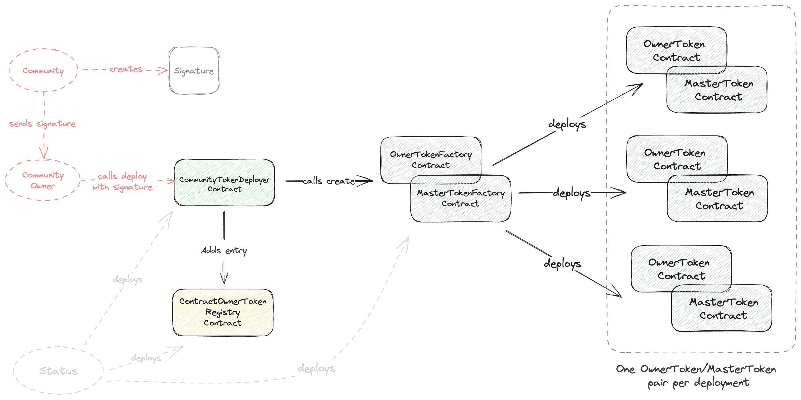

# Communities Contracts [![Github Actions][gha-badge]][gha] [![Codecov][codecov-badge]][codecov] [![Foundry][foundry-badge]][foundry]

[gha]: https://github.com/status-im/communities-contracts/actions
[gha-badge]: https://github.com/status-im/communities-contracts/actions/workflows/test.yml/badge.svg
[codecov]: https://codecov.io/gh/status-im/communities-contracts
[codecov-badge]: https://codecov.io/gh/status-im/communities-contracts/graph/badge.svg
[foundry]: https://getfoundry.sh/
[foundry-badge]: https://img.shields.io/badge/Built%20with-Foundry-FFDB1C.svg

Smart contracts for access control and token gated Status communities.

This projects implements smart contracts that are used by Status to enable token gated communities and access control for various roles within communities.

# Deployments

| **Contract**                | **Address**                                                                                                                             | **Snapshot**                                                                                                      |
| --------------------------- | --------------------------------------------------------------------------------------------------------------------------------------- | ----------------------------------------------------------------------------------------------------------------- |
| **Optimism Goerli**         |                                                                                                                                         |                                                                                                                   |
| CommunityTokenDeployer      | [`0xfFa8A255D905c909379859eA45B959D090DDC2d4`](https://goerli-optimism.etherscan.io/address/0xfFa8A255D905c909379859eA45B959D090DDC2d4) | [`e7d799b76`](https://github.com/status-im/communities-contracts/commit/e7d799b761e87166ecee4efaaede0b7a6cc367ad) |
| CommunityOwnerTokenRegistry | [`0x99F0Eeb7E9F1Da6CA9DDf77dD7810B665FD85750`](https://goerli-optimism.etherscan.io/address/0x99F0Eeb7E9F1Da6CA9DDf77dD7810B665FD85750) | [`e7d799b76`](https://github.com/status-im/communities-contracts/commit/e7d799b761e87166ecee4efaaede0b7a6cc367ad) |
| CommunityOwnerTokenFactory  | [`0x76d0E484e7c3398922636960Ab33bDe6E9936D81`](https://goerli-optimism.etherscan.io/address/0x76d0E484e7c3398922636960Ab33bDe6E9936D81) | [`e7d799b76`](https://github.com/status-im/communities-contracts/commit/e7d799b761e87166ecee4efaaede0b7a6cc367ad) |
| CommunityMasterTokenFactory | [`0x420BE6568c6E09782CEAE1575495Cd6C1c7EA04D`](https://goerli-optimism.etherscan.io/address/0x420BE6568c6E09782CEAE1575495Cd6C1c7EA04D) | [`e7d799b76`](https://github.com/status-im/communities-contracts/commit/e7d799b761e87166ecee4efaaede0b7a6cc367ad) |

# Documentation

## Table of Contents

- [About the project](#about-the-project)
- [Understanding roles](#understanding-roles)
  - [Owners](#owners)
  - [Token Masters](#token-masters)
  - [Admins](#admins)
- [Community tokens](#community-tokens)
  - [BaseToken](#basetoken)
  - [Ownertoken](#ownertoken)
  - [MasterToken](#mastertoken)
  - [CollectibleV1](#collectiblev1)
  - [CommunityERC20](#communityerc20)
- [Deploying community tokens](#deploying-community-tokens)
  - [CommunityTokenDeployer](#communitytokendeployer)
  - [CommunityOwnerTokenFactory](#communityownertokenfactory)
  - [CommunityMasterTokenFactory](#communitymastertokenfactory)
  - [CommunityTokenRegistry](#communityownertokenregistry)
- [Installation and development](#installation-and-development)
  - [Prerequisites](#prerequisites)
  - [Development](#development)
  - [Build](#build)
  - [Clean](#clean)
  - [Compile](#compile)
  - [Coverage](#coverage)
  - [Deploy](#deploy)
  - [Format](#format)
  - [Gas usage](#gas-usage)
  - [Lint](#lint)
  - [Test](#test)

## About the project

[Status](https://status.im) provides a platform for users to create communities with shared interests.
A community is similar to a chat server that comes with various channels that users can join to talk to each other and exchange messages. Communities can be configured that only selected users can join, provided they satisfy certain criteria.
This criteria is expressed via different types of tokens for different roles within the community.

The smart contracts of this repository implement these tokens and how they'll be deployed by Status community owners.

## Understanding roles

There are different roles in a Status community. Gaining roles in a community is done by proving ownership of certain assets and tokens. Below is a summary of the existing roles and what token funds are necessary to get a role:

| **Role**     | **Description**                               | **Count** | **Token ownership**                                                           |
| ------------ | --------------------------------------------- | --------- | ----------------------------------------------------------------------------- |
| Owner        | Owner of the Status community.                | 1         | `OwnerToken`                                                                  |
| Token Master | Helps creating community tokens and airdrops. | 0-n       | `MasterToken`                                                                 |
| Admin        | Helps maintaining the community.              | 0-n       | Combination of `CollectibleV1`, `CommunityERC20`, `ERC721`, `ERC20`           |
| Member       | Member of the community.                      | 0-n       | None or any combintion of `CollectibleV1`, `CommunityER20`, `ERC721`, `ERC20` |

### Owners

An owner is a Status user that has typically created a Status community and therefore "owns" it.
Owners have special privileges within a Status community, such as:

- transferring community ownership to other accounts
- creating community tokens (`CollectiveV1`, `CommunityERC20`)
- creating token permissions
- airdropping tokens to other users

The owner role is represented via ownership of the `OwnerToken`, which is part of this repository.
The `OwnerToken` is an `ERC721` token and exists only once per community.

### Token Masters

A token master is a Status user that has special privileges within a Status community.
A token master is allowed to create community tokens (`CollectibleV1`, `CommunityERC20`), new token permissions as well as airdropping tokens to other accounts.
The primary reason for token masters to exist is that they help the single owner of the community with token related actions.

There can be none or multiple token masters within a single Status community.
The token master role is represented via ownership of the `MasterToken`, which is part of this repository.

### Admins

An admin is a member of a Status community with special privileges, such as:

- creating token permissions
- editing information about the community
- creating chat categories and channels

Owners and token masters can create token permissions in the community to make other users admins of the community.

The admin role is represented via ownership of any token combination of `CollectibleV1`, `CommunityERC20`, `ERC721`, and `ERC20` tokens.
The owner or token masters have to create a token permission to specify which token ownership is needed to be an admin in the community.

Both, `CollectibleV1` and `CommunityERC20` tokens are part of this repository.

## Community tokens

To create roles and other token permissions in a Status community, certain tokens have to be created or referenced in the system.

While any `ERC721` and `ERC20` tokens can be referenced and used to create membership, view and post, or admin permissions in a community, the tokens necessary to be an owner or token master of a community are specifically deployed from within that community using a Status application.

Below is a description of all community tokens that can be deployed and minted through Status.

### `BaseToken`

`BaseToken` is an abstract contract that `OwnerToken`, `MasterToken`, and `CollectibleV1` inherit from to get shared functionality.
`BaseToken` is an `ERC721` token that offers some custom functionality:

- A custom `onlyOwner` modifier that checks for ownership of wither `OwnerToken` or `MasterToken`
- The ability to configure a maximum supply. This is used for both `MasterToken` and `CollectibleV1` tokens.
- A `mintTo` function that allows for minting tokens to multiple addresses at once.
- A mechanism to burn tokens "remotely". The use case here is to remove token masters or admins privileges.

Not all inheriting contracts make use of all of the custom functionality.

### `OwnerToken`

The token that represents ownership of a Status community. `OwnerToken` inherits from `BaseToken` and immediately mints a token to the deployer. There can only ever be one owner of a community, so the max supply is kept at one.

An `OwnerToken` can however be transferred to another account to effectively transfer ownership of a community.

This token also maintains a `signerPublicKey` which is the public key of a Status account that signs of changes in the Status community.

### `MasterToken`

The `MasterToken` is coexists with the `OwnerToken`, however there's no mechanism in place that guarantees the minting of such a token. The `MasterToken` represents the token master role within a community and also inherits `BaseToken`.

`MasterToken` are not transferrable but remote burnable. This ensures malicious users can't allow other users to create or airdrop tokens via Status communities.

### `CollectibleV1`

`CollectibleV1` token inherits `BaseToken` and are used to create custom NFTs for Status communities.
The use case for these tokens are role based permissions.
Owners or token masters might deploy instances of this token to create token permissions that introduce an admin role, or permissoins to view and/or post to channels.

`CollectibleV1` tokens can also be configured to be transferrable or remote burnable.
Creators of such a token can also specify their maximum supply.

### `CommunityERC20`

This token is a custom `ERC20` implementation that adds some functionality needed in Status communities. Status users can specify a custom `decimals` value for this token as well as a custom maximum supply.
Similar to `BaseToken`, this token comes with a `mintTo` function that allows for minting this token to multiple addresses.

## Deploying community tokens

Some of the tokens listed above, namely `OwnerToken` and `MasterToken`, are tokens that give special privileges to users of a Status community. To ensure users can't temper with the validity of contract addresses for `OwnerToken`s, and other users of the network can verify that such a token was indeed deployed by a community via a Status application, there's a special deployment process for these tokens which we cover in this section.

_For more information on the reasoning of this process, see the discussion in [this issue](https://github.com/status-im/status-desktop/issues/11954)._

Below is a graphic that shows the system from a birds-eye view:



A Status community is essentially a private/public key pair.
The `OwnerToken` and `MasterToken` will be deployed by a community owner, on behalf of the community.
To ensure accounts can only deploy the tokens for the community they have created, they need to provide a signature that was created by the community.

Here's how the deployment of community `OwnerToken`/`MasterToken` generally works:

1. Status community creates a signature which includes the address of the community, the address of the owner (who'll do the deployment), and an expiration date of the signature.
2. Status community owner takes the signature and sends it along with some deployment parameters to the `CommunityTokenDeployer` contract.
3. `CommunityTokenDeployer` contract verifies
   3.1. If the community has not already deployed its token
   3.2. If the provided signature is valid and the sender of the transaction is indeed the account that can do the deployment
4. If all checks are okay, the `CommunityTokenDeployer` will create and instance of `OwnerToken` and `MasterToken` using `CommunityOwnerTokenFactory` and `CommunityMasterTokenFactory` contracts.
   4.1. The `OwnerToken` will be minted to the owner account that performed the deployment
5. The contract address of `OwnerToken` is added to the `CommunityOwnerTokenRegistry`

It's important to note that Status deploys `CommunityTokenDeployer`, `CommunityOwnerTokenRegistry`, `CommunityOwnerTokenFactory` and `CommunityMasterTokenFactory`.
Status clients will talk directly to the deployer contract when users attempt to create their communities `OwnerToken` and `MasterToken`.

Also, Status may deploy these contracts on multiple EVM chains.

### Deployment contracts

#### `CommunityTokenDeployer`

This contract is deployed by Status and responsible for deploying `OwnerToken` and `MasterToken` instances via `CommunityOwnerTokenFactory` and `CommunityMasterTokenFactory`.

It maintains addresses for the aforementioned factories, as well as for the `CommunityOwnerTokenRegistry`, which is used to store known `OwnerToken` addresses for communities.

It's `deploy()` function is the entry point for end users.

#### `BaseTokenFactory`

An abstract contract that implements shared functionality for token factories used within the system.
The functionality provided by this contract are custom modifiers to check token metadata validity and authorization.

#### `CommunityOwnerTokenFactory`

This contract inherits `BaseTokenFactory` and implements a `create()` function that deploys and instance of `OwnerToken` using the supplied token metadata.

#### `CommunityMasterTokenFactory`

This contract inherits `BaseTokenFactory` and implements a `create()` function that deploys and instance of `MasterToken` using the supplied token metadata.

#### `CommunityOwnerTokenRegistry`

This contract implements a global registry for community addresses and their `OwnerToken` addresses.
After `CommunityTokenDeployer` has successfully deployed the `OwnerToken`, it will add its address to the registry, allowing anyone to verify the owner token address provided by any community.

## Installation and development

### Prerequisites

The following tools need to be installed first:

- [Git](https://git-scm.com)
- [Foundry](https://getfoundry.sh)
- [PNPM](https://pnpm.io/)

### Instructions

First, clone the repository via git:

```
$ git clone https://github.com/status-im/communities-contracts.git
```

Then, navigate into the folder and initialize/update git submodules:

```
$ cd communities-contracts
$ git submodule deinit --force .
$ git submodule update --init --recursive
```

Then, install all node dependencies:

```
$ pnpm install
```

### Development

This is a list of the most frequently needed commands.

### Build

Build the contracts:

```sh
$ forge build
```

### Clean

Delete the build artifacts and cache directories:

```sh
$ forge clean
```

### Compile

Compile the contracts:

```sh
$ forge build
```

### Coverage

Get a test coverage report:

```sh
$ forge coverage
```

### Deploy

Deploy to Anvil:

```sh
$ forge script script/DeployContracts.s.sol --broadcast --fork-url http://localhost:8545
```

For this script to work, you need to have a `MNEMONIC` environment variable set to a valid
[BIP39 mnemonic](https://iancoleman.io/bip39/).

For instructions on how to deploy to a testnet or mainnet, check out the
[Solidity Scripting](https://book.getfoundry.sh/tutorials/solidity-scripting.html) tutorial.

### Format

Format the contracts:

```sh
$ forge fmt
```

### Gas Usage

Get a gas report:

```sh
$ forge test --gas-report
```

### Lint

Lint the contracts:

```sh
$ pnpm lint
```

### Test

Run the tests:

```sh
$ forge test
```
